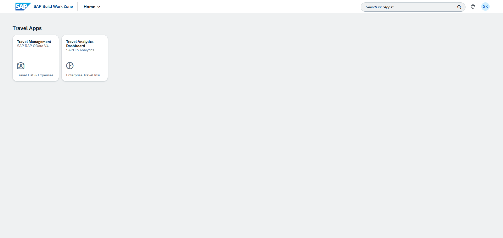
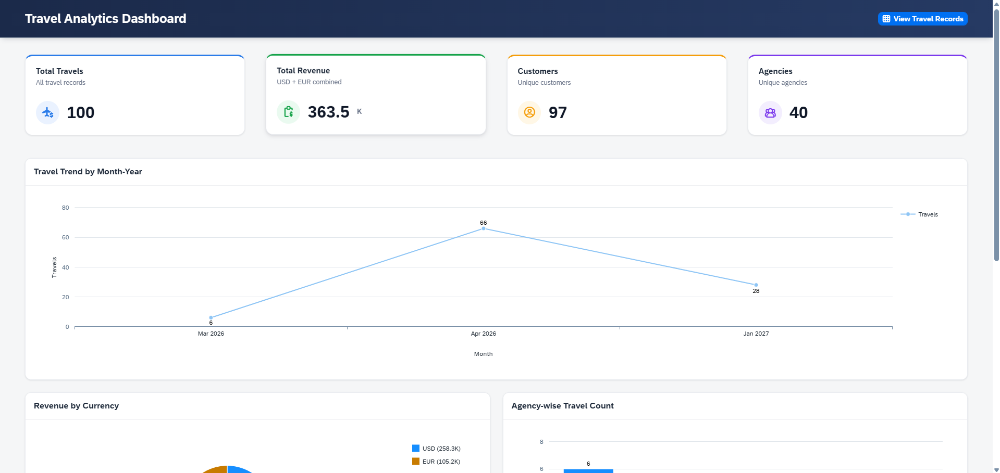
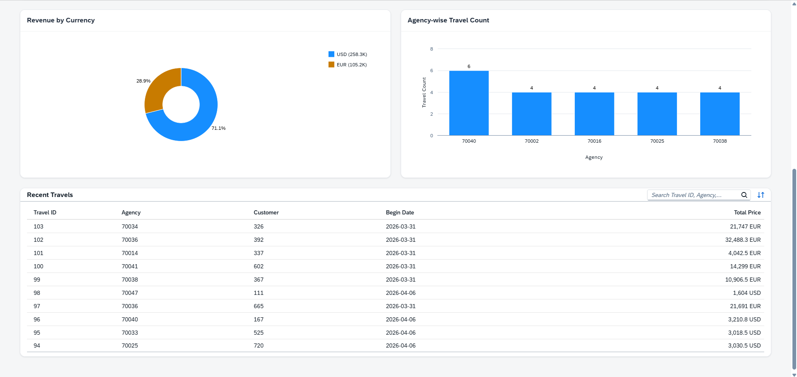
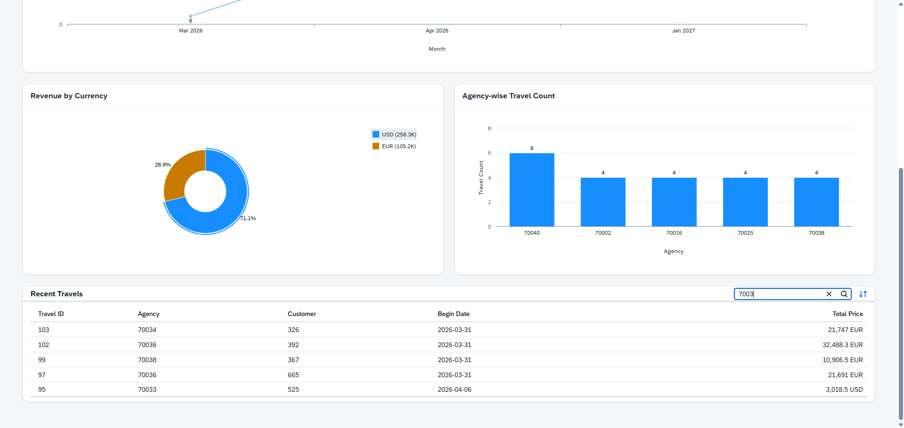

# Travel Analytics Dashboard

A modern **SAPUI5 Freestyle** analytics dashboard built on **SAP BTP** that visualizes travel business data through interactive KPI cards, charts, and analytical tables.

The application was developed using **SAP Business Application Studio** and deployed to **SAP Build Work Zone** through **Multi-Target Application (MTA)** deployment and the **HTML5 Applications Repository**.

The dashboard demonstrates enterprise dashboard development using SAPUI5, SAP Viz charts, responsive UI design, Cloud Foundry deployment, and SAP Build Work Zone integration.

**Highlights:** SAPUI5 Freestyle · SAP Viz Charts · Responsive Dashboard · JSON Model · MTA Deployment · SAP BTP Cloud Foundry · HTML5 Applications Repository · SAP Build Work Zone

---

## Project Introduction

The Travel Analytics Dashboard is a companion analytics application for a Travel Management solution built on SAP BTP.

While the **Travel Management** application (built using SAP RAP) focuses on transactional travel booking operations, this dashboard focuses on business analytics by presenting travel information through KPI cards, charts, and analytical tables.

The dashboard visualizes analytics generated from **100 travel records exported from the SAP RAP backend**. The exported dataset is consumed through a local JSON model, while KPI calculations, chart aggregations, trend analysis, and analytical views are performed client-side using JavaScript.

This implementation was chosen due to deployment limitations within the SAP BTP Trial environment while still demonstrating enterprise dashboard development, deployment, and Work Zone integration.

---

## Architecture

```text
SAP RAP Backend
        │
        ▼
Exported Travel Dataset
(100 Travel Records)
        │
        ▼
Local JSON Model
        │
        ▼
SAPUI5 Freestyle Dashboard
        │
        ▼
HTML5 Applications Repository
        │
        ▼
SAP BTP Cloud Foundry
        │
        ▼
SAP Build Work Zone
        │
        ▼
Navigation to Travel Management Application
```

---

## Technology Stack

| Layer | Technology |
|--------|------------|
| Frontend | SAPUI5 Freestyle |
| Charts | SAP Viz Framework (`sap.viz`) |
| Data Source | Local JSON Model (exported from SAP RAP backend) |
| IDE | SAP Business Application Studio |
| Deployment | Multi-Target Application (MTA) |
| Runtime | SAP BTP Cloud Foundry |
| Repository | HTML5 Applications Repository |
| Launchpad | SAP Build Work Zone |

---

## Key Features

- Interactive KPI Cards
- Travel Trend Analysis
- Revenue Breakdown by Currency
- Agency-wise Travel Count
- Recent Travels Table with Search & Sorting
- Responsive SAPUI5 Freestyle Dashboard
- Client-side analytical calculations
- SAP Viz interactive charts
- SAP Build Work Zone deployment
- Navigation to the companion Travel Management application

---

## UI/UX Design Decisions

Coming from a UX/UI design background, I treated the dashboard as both a business application and a user experience exercise.

Key improvements include:

- Designed a modern card-based dashboard instead of the default Fiori layout.
- Created consistent KPI cards using color hierarchy, spacing, and elevation.
- Improved dashboard readability using responsive layouts and visual grouping.
- Corrected trend analysis by grouping records using both **Month** and **Year**, preventing records from different years from being merged.
- Simplified the Recent Travels table by removing redundant information while improving readability.
- Added a custom dashboard header to improve navigation and visual hierarchy.

---

## Screenshots

### SAP Build Work Zone



---

### Dashboard Overview

#### KPI Cards & Travel Trend



#### Charts & Recent Travels



#### Search Interaction



---

## Demo Video

A short walkthrough demonstrating:

- SAP Build Work Zone
- Dashboard Launch
- KPI Cards
- Interactive Charts
- Search Functionality
- Navigation to the Travel Management application

```text
video/travel-analytics-dashboard-demo.mp4
```

---

## Deployment

The application was developed and deployed using:

- SAP Business Application Studio
- Multi-Target Application (MTA)
- SAP BTP Cloud Foundry
- HTML5 Applications Repository
- Destination Service
- XSUAA
- SAP Build Work Zone

---

## Challenges & Solutions

### 1. MTA build not generating a deployable HTML5 application

#### Challenge

Adding an ABAP deployment configuration modified the UI5 build process and prevented the MTA build from generating the required HTML5 application ZIP.

#### Solution

Replaced the ABAP deployment build task with **ui5-task-zipper**, allowing the MTA build to correctly package the application for Cloud Foundry deployment.

---

### 2. SAP Build Work Zone loading an older application version

#### Challenge

After successfully deploying a new MTA version, SAP Build Work Zone continued opening the previous dashboard version.

#### Root Cause

The HTML5 Apps content still referenced the previously deployed application version.

#### Solution

Updated the HTML5 Apps configuration inside SAP Build Work Zone to reference the latest deployed application version, after which the tile correctly loaded the newest dashboard.

---

### 3. SAP BTP Trial deployment limitation

#### Challenge

The initial goal was to consume live SAP RAP OData V4 data directly from the dashboard.

#### Solution

Due to SAP BTP Trial limitations affecting the backend deployment scenario, the dashboard was implemented using a dataset exported from the RAP backend. This approach allowed development of the analytical dashboard while still demonstrating SAPUI5 development, Cloud Foundry deployment, MTA deployment, and SAP Build Work Zone integration.

---

## Related Project

### Travel Management (SAP RAP)

This dashboard is part of a two-application SAP BTP solution.

The companion **Travel Management** application was developed using:

- SAP RAP (ABAP RESTful Application Programming Model)
- CDS View Entities
- Behavior Definitions
- OData V4 Service
- SAP Fiori Elements
- SAP Build Work Zone Integration

The dashboard provides direct navigation to this application through SAP Build Work Zone, demonstrating integration between analytical and transactional SAP applications.

**Repository:**

👉 https://github.com/SASIPKP/travel-management-rap

---

## Author

### Sasi Kumar

**SAP UI5 Developer | UX/UI Designer**

Building enterprise applications on SAP BTP using **SAPUI5 Freestyle**, **SAP RAP**, **Cloud Foundry**, **Multi-Target Applications (MTA)**, and **SAP Build Work Zone**.
